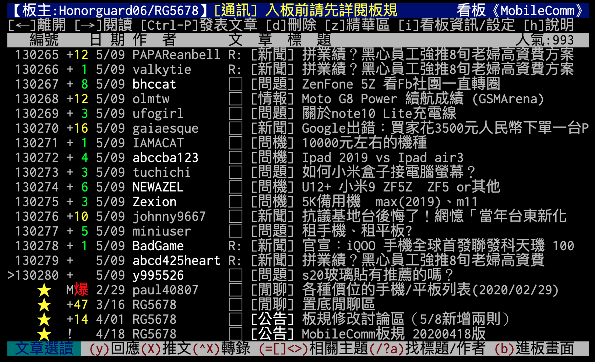
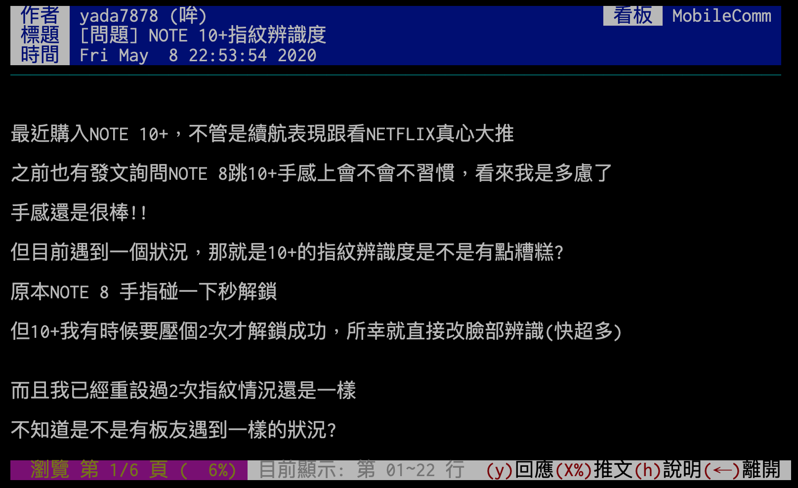
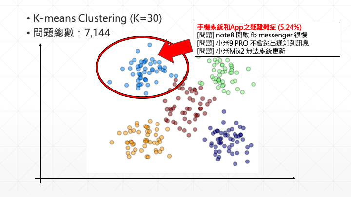
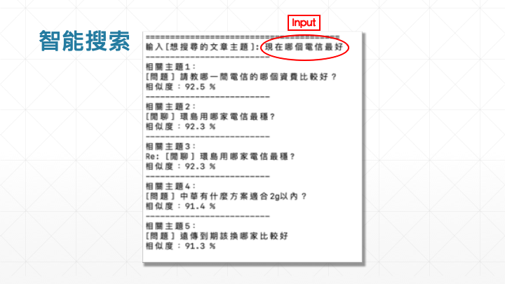

# Mobile Phone Analysis
Final Project of Database Management
- [Database Management](http://homepage.ntu.edu.tw/~wyang/db2019/index.html)

### Data Source:
- [PTT MobileComm板(Taiwan's Largest Online Forum)](https://www.ptt.cc/bbs/MobileComm/index.html)

### Application 1: Common Phone Problems Clustering

- 篩選[問題]分類的文章
- 將文章標題透過BERT神經網路模型的轉換為句子向量
- 用K-Means對文章進行分群

### Application 2: Smart Searching Engine

- 將文章標題透過BERT神經網路模型的轉換為句子向量
- 計算[輸入句子]與每篇[文章標題]的相似度
- 列出最相似者

### Application 3: Phone Suggestions (unfinished)
- 按照使用者輸入的四大條件給予手機推薦
	- (一) 預算區間/已選擇之機種 (若為請版友選擇你考慮的機種，請填機種在這)
	- (二) 使用需求 (例如:螢幕尺寸、拍照、高續航、高效能...等等)
	- (三) 系統/品牌喜好 (例如:要XX品牌...不要XX品牌)
	- (四) 補充說明 (補充說明以上沒提到的點)

